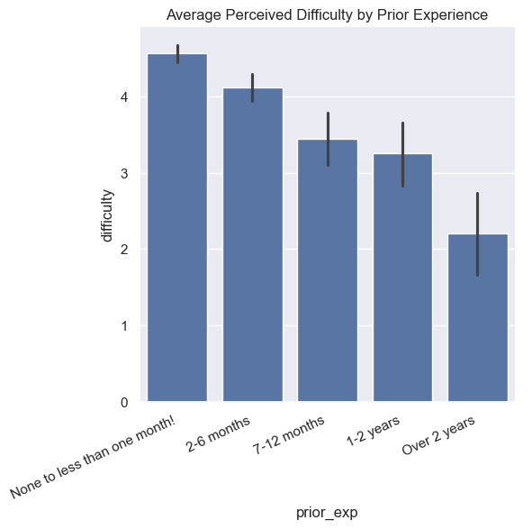
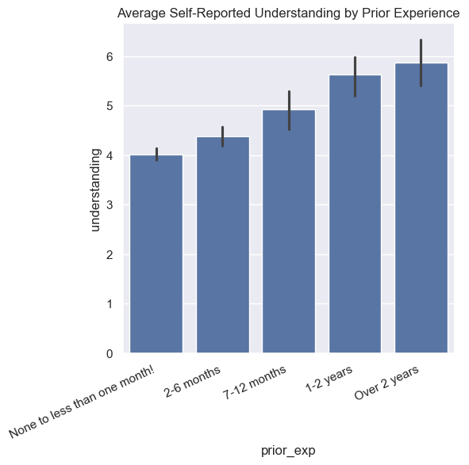
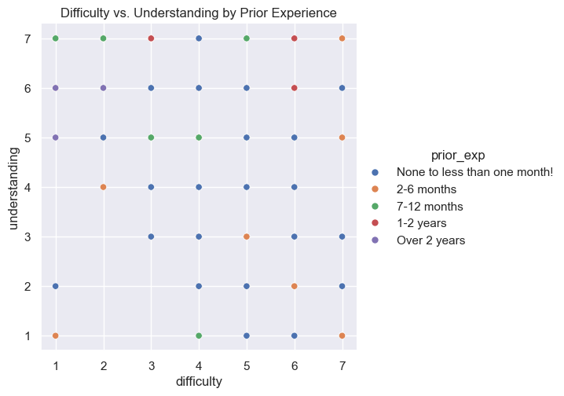

# Does Prior Experience Change How Hard COMP110 Feels?

**Course:** COMP110 — Spring 2026  
**Authors:** Your Name, Partner Name  

---

## Overview

In this project, we analyzed anonymized survey data from 534 COMP110 students to explore whether prior programming experience affects how difficult and understandable students find the course. Our goal was to identify whether a supplemental beginner-friendly track with adjusted pacing could create meaningful value for the majority of students.

---

## The Idea

The course should offer supplemental support for students with no prior programming experience because the data suggests a significant gap in perceived difficulty and self-reported understanding between beginners and more experienced students. 61% of respondents (328 out of 534) reported less than one month of prior experience, making this the highest-impact group to address.

---

## Analysis

We loaded and combined both survey CSV files using our `read_csv_rows`, `columnar`, and `concat` functions, then narrowed the data to four relevant columns using `select`: `prior_exp`, `difficulty`, `understanding`, and `pace`. We used `count` to examine the distribution of students across experience levels, then filtered out empty rows with a custom `filter_empty` helper function before converting numeric columns to integers for plotting.

### Experience Level Breakdown

Using `count`, we found the following distribution across experience levels:

| Prior Experience | Number of Students |
|---|---|
| None / less than 1 month | 328 (61%) |
| 2–6 months | 138 |
| 7–12 months | 34 |
| 1–2 years | 22 |
| Over 2 years | 12 |

### Chart 1: Average Difficulty by Prior Experience

This bar chart shows the average perceived difficulty rating (1–7) for each experience level. Students with no prior experience rated difficulty at **4.57 on average**, while students with over 2 years of experience rated it at just **2.25** — a gap of more than 2 full points.

### Chart 2: Average Understanding by Prior Experience

This bar chart shows self-reported understanding (1 = lost, 7 = understand everything) by experience level. Beginners averaged only **3.94**, below the midpoint, while the most experienced students averaged **5.83**.

### Chart 3: Difficulty vs. Understanding (Scatter)

Each point represents one student, colored by their prior experience level. Beginner students (red) cluster toward high difficulty and low understanding, while experienced students (blue/dark) cluster toward low difficulty and high understanding.

---

## Conclusion

The data **strongly supports** the idea that students with less prior programming experience find COMP110 significantly harder and report lower self-assessed understanding. The trend is consistent and monotonic across all five experience levels.

**Costs and trade-offs:** A separate beginner track requires more instructional staff and could stigmatize students who opt in. Slowing the main course pace risks disengaging experienced students. Any intervention should be additive — supplemental support rather than a replacement.

**Future work:** A mid-semester re-survey could track whether beginner understanding improves over time. Pairing perception data with actual grades would reveal whether the gap is reflected in real performance. Targeted beginner office hours or short supplemental videos could be piloted and measured without requiring a full separate track.